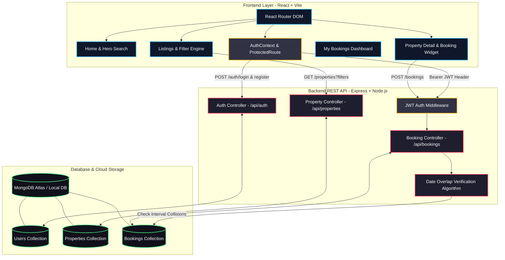

<div align="center">

  <h1>🏡 HomelyHub — Full-Stack MERN Property Booking Platform</h1>
  
  > **Modern Vacation Rental & Property Booking Platform built with MongoDB, Express.js, React (Vite), and Node.js featuring Dynamic Overlap Prevention, Real-Time Cost Computation, and Role-Based Access Control.**

  <br/>

  [](https://homely-hub-omega.vercel.app)
  [](https://homelyhub-backend-l32e.onrender.com)
  [](https://github.com/Shivam95800/HomelyHub/blob/main/HomelyHub_Project_Report.pdf)

  <br/>

  [](https://reactjs.org/)
  [](https://vitejs.dev/)
  [](https://nodejs.org/)
  [](https://expressjs.com/)
  [](https://www.mongodb.com/)
  [](https://mongoosejs.com/)
  [](https://jwt.io/)
  [](https://github.com/dcodeIO/bcrypt.js)
  [](LICENSE)

</div>

---

## 🔗 Live Deployment URLs

- 🌐 **Live Web Application:** [https://homely-hub-omega.vercel.app](https://homely-hub-omega.vercel.app)
- ⚙️ **Backend REST API:** [https://homelyhub-backend-l32e.onrender.com](https://homelyhub-backend-l32e.onrender.com)
- 🗄️ **Database Cluster:** MongoDB Atlas Cloud
- 📄 **Project Report PDF:** [HomelyHub_Project_Report.pdf](https://github.com/Shivam95800/HomelyHub/blob/main/HomelyHub_Project_Report.pdf)

---

## 📖 Overview

Traditional booking platforms are often bloated, complicated, or lack transparent pricing and instantaneous date validation.

**HomelyHub** delivers a streamlined, modern vacation rental experience connecting travelers with hand-picked villas, mountain chalets, and urban penthouses through a resilient MERN architecture:

1. **🔍 Multi-Criteria Search & Filter Engine**: Guests can dynamically filter properties by destination/city, budget limits (min/max price), and keyword matching across titles and descriptions.
2. **📅 Overlap-Free Booking Engine**: Real-time reservation validation that mathematically prevents double-booking using interval comparison queries against confirmed dates in MongoDB.
3. **⚡ Dynamic Live Pricing**: Instant client-side night counting and price breakdown with zero hidden fees.
4. **🔐 Dual-Role Access Control**: Granular separation between **Travelers (Guests)** and **Property Hosts (Owners)** with protected routing and JWT bearer authorization.
5. **🎨 High-End Design System**: Clean typography (`Plus Jakarta Sans`), glassmorphism navigation, dynamic rating indicators, and interactive micro-interactions.

---

## 🏗️ Architecture & Workflow



---

## 🎨 Design System & UI Highlights

HomelyHub is built with a product-first, sleek visual aesthetic:

- **💎 Modern Glassmorphic Navigation**: Frosted header bar (`backdrop-filter: blur(12px)`) with dynamic user greeting and session indicators.
- **🏖️ Rich Media Property Cards**: Visual property cards with per-night badges, location pins, customer ratings, and image fallbacks.
- **⚡ Interactive Booking Widget**: Sticky price calculator that automatically computes stay duration and total cost upon date selection.
- **📱 Fully Responsive**: Fluid multi-column CSS grid layouts optimized across mobile phones, tablets, and desktop displays.

---

## ✨ Key Features

| Feature | Description | Technology Stack |
| :--- | :--- | :--- |
| **🔐 Role-Based Authentication** | Secure registration and login with encrypted passwords and JWT token persistence. | `bcryptjs`, `jsonwebtoken`, `AuthContext` |
| **🔍 Search & Multi-Filters** | Real-time filtering by keyword, location (regex), and custom price ranges. | `Express.js`, `Mongoose Regex Query` |
| **🚫 Overlap Prevention** | Algorithmic interval collision check: `(checkIn < bookedOut && checkOut > bookedIn)`. | `Mongoose $and / $lt / $gt` |
| **💳 Live Cost Calculation** | Computes night counts and total reservation costs dynamically on date input. | `React Hooks`, `JavaScript Date` |
| **📋 Bookings Dashboard** | Unified dashboard showing confirmed reservations, dates, prices, and cancellation actions. | `React Router`, `Axios Interceptor` |
| **🌱 Instant DB Seeding** | 1-command seeding script to generate verified properties and ready-to-test host/guest users. | `Node.js`, `Mongoose Script` |

---

## 🛠️ Tech Stack

<div align="center">

| Domain | Technologies Used |
| :--- | :--- |
| **Frontend & UI** | [React.js](https://react.dev/), [Vite](https://vitejs.dev/), [React Router](https://reactrouter.com/), [Lucide React](https://lucide.dev/), [Plus Jakarta Sans](https://fonts.google.com/specimen/Plus+Jakarta+Sans) |
| **Backend & API** | [Node.js](https://nodejs.org/), [Express.js](https://expressjs.com/), [CORS](https://github.com/expressjs/cors), [Dotenv](https://github.com/motdotla/dotenv) |
| **Database & ODM** | [MongoDB Atlas](https://www.mongodb.com/cloud/atlas), [Mongoose ODM](https://mongoosejs.com/) |
| **Security & Auth** | [JSON Web Tokens (JWT)](https://jwt.io/), [Bcrypt.js](https://github.com/dcodeIO/bcrypt.js) |
| **HTTP & API** | [Axios](https://axios-http.com/) (with Request/Response Interceptors) |

</div>

---

## 🗄️ Database Setup (MongoDB Atlas)

HomelyHub is pre-configured to work with **MongoDB Atlas** or a local instance:

### 1. MongoDB Atlas Cloud Setup (Recommended)
1. Create a free account at [cloud.mongodb.com](https://cloud.mongodb.com/).
2. Create a free **M0 Shared Cluster**.
3. In **Network Access**, add `0.0.0.0/0` (Allow access from anywhere).
4. In **Database Access**, create a database user with password.
5. In [server/.env](file:///c:/Users/Asus/OneDrive/Documents/HomelyHub/server/.env), set:
   ```env
   MONGO_URI=mongodb+srv://<username>:<password>@cluster0.xxx.mongodb.net/homelyhub?retryWrites=true&w=majority
   ```

---

## 📂 Project Structure

```text
HomelyHub/
├── client/                             # React Frontend (Vite)
│   ├── public/
│   ├── src/
│   │   ├── api/
│   │   │   └── axios.js                # Configured Axios instance + Auth Interceptor
│   │   ├── components/
│   │   │   ├── Navbar.jsx              # Responsive header with dynamic auth menu
│   │   │   ├── Footer.jsx              # Reusable footer
│   │   │   ├── PropertyCard.jsx        # Reusable listing card
│   │   └── ProtectedRoute.jsx      # Route guard for authenticated paths
│   │   ├── context/
│   │   │   └── AuthContext.jsx         # Global Auth Context & Hook
│   │   ├── pages/
│   │   │   ├── Home.jsx                # Landing page & hero search
│   │   │   ├── Listings.jsx            # Filterable property catalog
│   │   │   ├── PropertyDetail.jsx      # Details & interactive booking widget
│   │   │   ├── Login.jsx               # Sign-in page
│   │   │   ├── Signup.jsx              # Registration page with role selector
│   │   │   └── MyBookings.jsx          # Trips dashboard & cancellation
│   │   ├── App.jsx                     # App router & layout
│   │   ├── index.css                   # Global CSS design system
│   │   └── main.jsx                    # Client entry point
│   ├── .env.example
│   ├── package.json
│   └── vite.config.js
│
├── server/                             # Express REST API (Node.js)
│   ├── config/
│   │   └── db.js                       # MongoDB connection & DNS resolver
│   ├── controllers/
│   │   ├── authController.js           # Register, login, user profile
│   │   ├── propertyController.js       # Property CRUD & filter queries
│   │   └── bookingController.js        # Booking logic & overlap validator
│   ├── middleware/
│   │   └── authMiddleware.js           # JWT verification & role authorization
│   ├── models/
│   │   ├── User.js                     # User Mongoose schema
│   │   ├── Property.js                 # Property Mongoose schema
│   │   └── Booking.js                  # Booking Mongoose schema
│   ├── routes/
│   │   ├── authRoutes.js               # /api/auth
│   │   ├── propertyRoutes.js           # /api/properties
│   │   └── bookingRoutes.js            # /api/bookings
│   ├── seed.js                         # Database mock data seeder
│   ├── .env                            # Server environment variables
│   ├── .env.example
│   ├── index.js                        # Server entry point
│   └── package.json
│
├── .gitignore                          # Ignored dependencies & secrets
├── HomelyHub_Project_Report.pdf        # Generated PDF project report
├── PROJECT_REPORT.md                   # Formal internship project report
└── README.md                           # Documentation
```

---

## 🚀 Getting Started

### 1. Prerequisites
- **Node.js 18+** installed
- **MongoDB Atlas** account or local MongoDB server

### 2. Clone the Repository
```bash
git clone https://github.com/Shivam95800/HomelyHub.git
cd HomelyHub
```

### 3. Backend Setup
```bash
cd server
npm install

# Seed the database with sample properties & test accounts
npm run seed

# Start the development server
npm run dev
```
*Backend server runs at: `http://localhost:5000`*

### 4. Frontend Setup
```bash
# In a new terminal
cd client
npm install

# Start the Vite development server
npm run dev
```
*Frontend app runs at: `http://localhost:5173`*

---

## 🔑 Demo & Test Accounts

The seed script (`npm run seed`) automatically prepares ready-to-test accounts:

| Role | Email | Password | Permissions |
|---|---|---|---|
| **Property Host / Owner** | `host@homelyhub.com` | `password123` | Create listings, edit & manage properties |
| **Guest / Traveler** | `guest@homelyhub.com` | `password123` | Explore, book stays, manage trips |

---

## ☁️ Deployment Guide

### 1. Deploy Backend (Render / Railway)
1. Connect your GitHub repository.
2. Root directory: `server`
3. Build command: `npm install`
4. Start command: `npm start`
5. Environment Variables:
   ```env
   PORT=5000
   MONGO_URI=your_mongodb_atlas_connection_string
   JWT_SECRET=your_jwt_secret_key
   CLIENT_URL=https://your-frontend.vercel.app
   ```

### 2. Deploy Frontend (Vercel / Netlify)
1. Connect your GitHub repository.
2. Root directory: `client`
3. Build command: `npm run build`
4. Output directory: `dist`
5. Environment Variables:
   ```env
   VITE_API_BASE_URL=https://your-backend.onrender.com/api
   ```

---

## 🖥️ User Workflows

### 🏖️ Guest Flow
1. **Search Stays**: Browse verified properties or filter by city (e.g. *Goa*, *Manali*) and budget range.
2. **Calculate Price**: Choose check-in and check-out dates on the Property Detail page to view instant total cost.
3. **Instant Reservation**: Reserve your stay; the engine checks for overlap and confirms instantly.
4. **Manage Trips**: Review your confirmed bookings in **My Bookings** and cancel if needed.

### 🏡 Host Flow
1. **Host Login / Registration**: Sign up as a Property Host.
2. **Post Properties**: Publish new listings with images, amenities, pricing, and descriptions.
3. **Manage Inventory**: Update details or remove listings in real-time.

---

## 📄 License

This project is licensed under the **MIT License** — see the [LICENSE](LICENSE) file for details.

---

<div align="center">
  <sub>Developed with ❤️ by <a href="https://github.com/Shivam95800">Shivam</a> & the Open Source Community.</sub>
</div>
